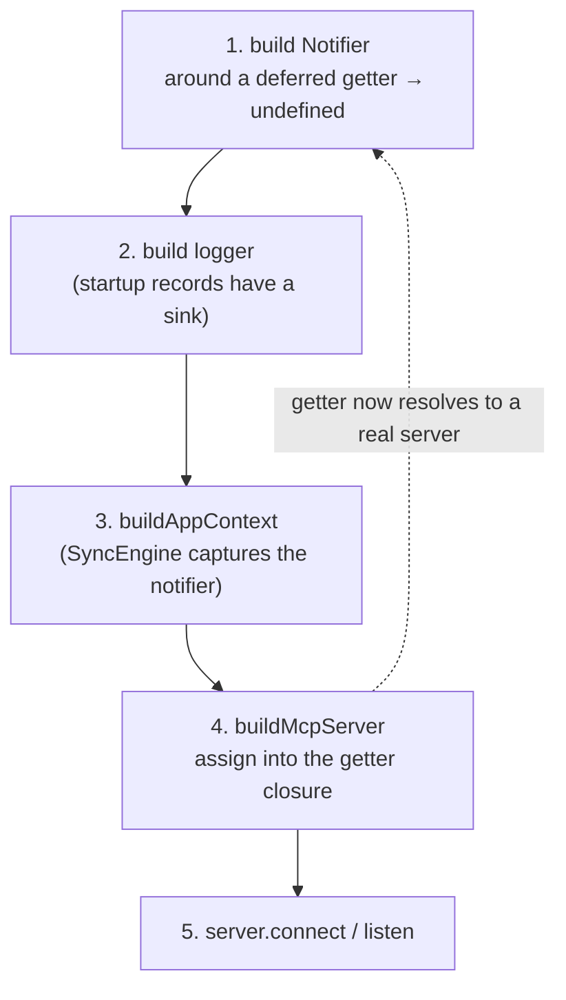

# ADR-0001: Two MCP transports over one composition root

**Status:** Accepted (2026-06-01, backfilled)

## Context

mcp-paprika exposes the Paprika recipe manager to MCP clients. Those clients fall into two operational worlds that the protocol explicitly accommodates with different wire transports:

- **Local clients** (Claude Desktop, Claude Code, Cursor, mcp-cli) speak MCP over a stdio pipe. The server is a child process of the client; stdin/stdout carry the JSON-RPC framing. There is exactly one logical session for the process lifetime, the channel is a trusted local pipe, and there is no authentication surface because the operating-system process boundary already establishes who is on the other end. A consequence that shapes everything downstream: stdout _is_ the protocol, so any stray write to it corrupts the wire.

- **Remote clients** (Claude Mobile and other hosted MCP clients) speak MCP over Streamable HTTP. Here the server is a long-lived network service, potentially behind Kubernetes, serving many concurrent clients at once. Each client needs its own session, the endpoint is reachable by anyone who can route to it, and identity therefore has to be proven rather than assumed. This world brings an OAuth 2.1 authorization surface (with upstream OIDC delegation), a readiness/liveness contract for an orchestrator, and graceful-shutdown semantics that respect a termination grace period.

The pressure these two worlds create is that the _business logic_ (the recipe/grocery/meal/menu tools, the resources, the background sync engine) is identical for both. Only the framing, the session multiplicity, and the auth/lifecycle envelope differ. The risk to avoid was forking that business logic, or letting "the transport" leak into mutation code. In particular, mutation code historically reached for "the server" to push `notifications/resources/list_changed` and logging notifications: a move well-defined under stdio (there is one server) but meaningless under HTTP (there are N, or zero during bootstrap).

This decision also subsumed a naming/shape cleanup. The original stdio-only design threaded a single flat `ServerContext` record (which bundled a concrete `McpServer`) into every handler. That shape cannot express "process-wide state that exists before and independently of any server," which is exactly what HTTP needs.

## Decision

Ship **two transports selected at startup by the `MCP_TRANSPORT` config knob** (`stdio` is the default; `http` opts into the network service), dispatched from a thin entry point that owns only signal wiring and the success/failure exit contract. Each transport is a self-contained entry point that returns a uniform shutdown handle, so the dispatcher does not care which one it started.

The stdio transport builds one notifier, one shared context, one server, connects the stdio transport, and optionally starts background sync. The HTTP transport stands up a Hono application exposing a `GET /healthz` readiness/liveness probe and an `ALL /mcp` JSON-RPC entry point, keeps a per-client session map (one `McpServer` plus its Streamable-HTTP transport per session, created on the MCP `initialize` request and looked up afterward by session-id header), and, when auth is configured, mounts the OAuth authorization-server surface (well-known metadata, dynamic client registration with rate-limit and client-cap guards, authorize/token/revoke, the upstream-IdP callback and RFC 7592 management routes, and a bearer-auth guard in front of `/mcp`) ahead of the MCP handler. Its shutdown handle implements a Kubernetes-aware drain: flip the readiness probe to failing so the orchestrator removes the pod from service endpoints, wait out a propagation window, then abort open SSE streams, evict sessions, drain the HTTP server, and stop background work, all under a hard timeout so a stuck request cannot outlast the grace period.

Both transports run **one composition root, unchanged**. The split is between two context types:

- **`AppContext`**: process-wide, heavyweight, built exactly once. It owns the Paprika client, the disk cache, every in-memory store, the optional vector and photography clients, the logger, the optional auth runtime, and, critically, the **`Notifier`**. It has **no `server` field**.
- **`SessionContext`**: `AppContext` plus the one `McpServer` for that session. This is what every tool and resource handler receives. Under stdio there is one for the whole process; under HTTP there is one per active session. The flat `ServerContext` name survives as a backward-compat type alias for `SessionContext`, so existing handler signatures compile untouched while new code prefers the authoritative pair.

The `Notifier` is the piece that lets mutation code stay transport-blind. Instead of calling "the server" to fan out a resource-list-changed or logging notification, callers go through `ctx.notifier`, which has two implementations chosen by transport: `singleServerNotifier` resolves to the single stdio server (via a getter, see below), and `broadcastNotifier` materializes a snapshot of all live sessions and fans the notification across them. Both swallow transport errors so a failed notification can never break the never-throws sync loop. A tool that adds a grocery item calls the same notifier method regardless of whether one client or twelve are listening.

The structured pino logger lives on `AppContext` too, and its `warn+` records fan out to connected MCP clients through that same `Notifier` abstraction, so the logger and the notification path share the one transport-agnostic seam rather than each re-discovering "the server."

The bootstrap order that resolves the `AppContext` ↔ server cycle (a deferred getter that returns `undefined` until the server is assigned) is the load-bearing sequence:

## Rejected alternatives

### A single transport (stdio-only, or HTTP-only)

Rejected because the two client worlds genuinely need different transports, and the more important one needs HTTP. The intended audience is broad (mobile, web, desktop, Claude Code, cowork), and those reach the server over HTTP, so HTTP is the transport that serves most potential users. stdio is retained as the local, single-machine / low-trust surface (and a convenient testable one), where the OS process boundary already establishes trust and no auth is needed. An HTTP-only build would have dropped the zero-ceremony local path; a stdio-only build would have abandoned the primary remote audience.

### A dependency-injection container instead of hand-wired contexts

Not deliberately weighed: hand-wiring was the default, not a considered rejection of a container. Recorded honestly rather than back-filled with a rationale: the deferred-getter bootstrap cycle (above) has since grown complex enough that a DI/container or a more structured builder may be the better shape. That evaluation is now [ADR-0005](0005-composition-modules-and-identifiers.md): the bootstrap was refactored into a phase-typed builder, and a DI container was _deferred_ behind a written trigger rather than rejected.

## Consequences

**Positive.**

- The entire tool/resource/sync layer is written once and is genuinely transport-agnostic. Adding a tool requires no awareness of session count, auth, or transport; it closes over a `SessionContext` and uses `ctx.notifier` for any push.
- The no-`server`-field invariant on `AppContext` is what makes process-wide state independent of session count. Because nothing process-wide can reach "the server," there is no place for stdio's one-server assumption to hide, and HTTP's N-server reality needs no special-casing in business code.
- The two transports degrade and scale on their own terms: stdio stays a zero-ceremony local pipe; HTTP gets its orchestrator contract (readiness drain, SSE abort, bounded shutdown) without leaking any of it downward.
- Keeping `ServerContext` as an alias made the rename a non-breaking change across the existing handler surface.

**Negative / costs.**

- **A load-bearing bootstrap order.** `AppContext` needs the notifier, but the notifier (in stdio mode) needs the server, which is built _from_ the `AppContext`: a cycle. It is broken with a deferred getter: the notifier is constructed first around a closure that returns `undefined` until the server is assigned later. The logger is constructed next (so startup records flow through structured logging), then `AppContext`, then the `McpServer`, then connect/listen. Log or notification calls that fire before the server exists fan out to a getter that returns `undefined` and silently no-op, safe by design, but only because the ordering holds. Collapsing or reordering these steps (e.g. trying to build the server before the context) makes the cycle unresolvable, so the sequence is intentionally pinned.
- **Asymmetric startup surface.** The HTTP path loads and assembles the entire auth subsystem at build time: it fetches the upstream OIDC discovery document, assembles the OAuth stores and provider, and fails fast if any of that is broken (there is no value in running an unauthenticated public endpoint). The stdio path loads none of it; its auth runtime is `null`. The invariant "auth is non-null iff transport is http" is real but it means the two transports do not exercise the same startup code, and a regression in the auth assembly is invisible to anyone testing only stdio.
- **One signal handler, two shutdown shapes.** The shared entry point wires SIGINT/SIGTERM to whichever handle was returned, but the two handles do very different amounts of work: stdio just stops the sync engine; HTTP runs the multi-phase timed drain. The signal handler deliberately writes directly to stderr rather than through the logger, because at signal time the logger may not be built yet (early startup failure) or may already be torn down. That is one of the few sanctioned exceptions to the otherwise strict "no direct stderr" rule that exists because stdout carries the stdio wire format.

## References

- Module contract: `src/server/CLAUDE.md` (AppContext/SessionContext split, Notifier, deferred-getter bootstrap order, invariants)
- MCP transport specifications: stdio and Streamable HTTP
