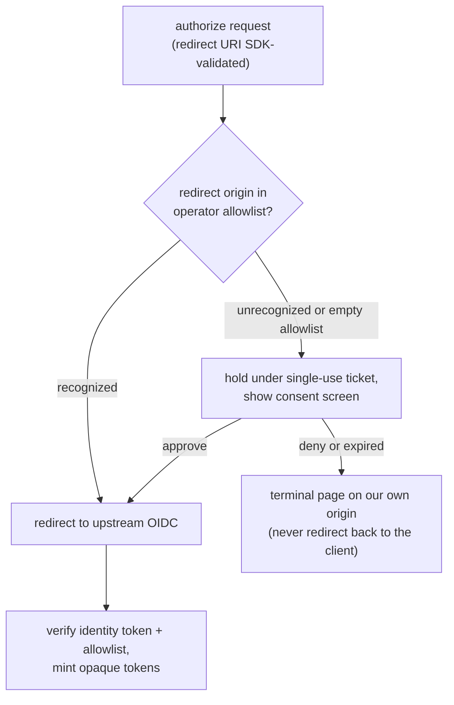

# ADR-0002: OAuth 2.1 authorization server with OIDC identity delegation on the HTTP transport

**Status:** Accepted (2026-06-01, backfilled)
**Last verified:** 2026-06-01

## Context

mcp-paprika exposes the same MCP tool surface over two transports. The stdio transport is a local, unauthenticated pipe: the operating-system process boundary and the user's own machine are the trust boundary, so there is nothing to authenticate. The HTTP transport is different — it is reachable over the network by remote MCP clients (Claude Mobile, claude.ai connectors, and other HTTP-capable clients), so it needs an authentication and authorization story before it can be exposed at all.

Two constraints shaped the design. First, the MCP authorization profile expects the server to behave as a standards-compliant OAuth 2.1 authorization server toward its clients: clients discover the authorization server via well-known metadata, register dynamically (they have no out-of-band relationship with this server), and obtain tokens through a PKCE-protected authorization-code flow. There is no human operator to hand-register each connecting client. Second, this is a single-operator deployment of a personal recipe manager — it has no user database, no password store, and no desire to own credential handling or identity proofing. Identity should come from an existing identity provider the operator already trusts (Google, Entra, Okta, Auth0, Keycloak, or any OIDC-compliant provider via raw discovery URL), with admission restricted to an operator-declared allowlist of specific people.

These two constraints pull toward a hybrid role. Toward MCP clients the server must be a full authorization server; toward the operator's identity provider it must be an OIDC client. The two relationships are independent: an MCP client must never see an upstream provider's tokens, and the upstream provider must never see a dynamically-registered MCP client's identifier.

A naive implementation of this shape has a known hazard. A server that accepts open dynamic client registration and then forwards every authorization request straight to a single statically-configured upstream client is a confused deputy: a malicious registered client can lure an allowlisted user through an attacker-initiated authorization request, ride the victim's live upstream session, and obtain a token bound to the victim's identity but delivered to the attacker's redirect target. The design had to close this gap, and had to do so without a per-client consent record (there is no admin UI and no persistent consent grant). The in-memory state that the authorization flow accumulates is also reachable on an unauthenticated, unthrottled endpoint, so its memory footprint had to be bounded against a flood.

## Decision

On the HTTP transport, act as a full OAuth 2.1 authorization server toward MCP clients while delegating all identity verification to one operator-configured upstream OIDC provider. The entire surface loads only when the transport is HTTP; in stdio mode the auth context is null and nothing in the auth module is instantiated.

**Two isolated OAuth relationships.** Toward MCP clients the server owns dynamic client registration (RFC 7591) and its management operations (RFC 7592), the PKCE-protected authorization and token endpoints, token revocation (RFC 7009), and the authorization-server and protected-resource metadata documents (RFC 8414, RFC 9728), including resource audience binding (RFC 8707) and the issuer response parameter that lets clients detect mix-up attacks (RFC 9207). Toward the upstream provider the server is an ordinary statically-registered OIDC client: it redirects the user to the provider, exchanges the returned code, and verifies the resulting identity token's signature, audience, nonce, and email-verification claim against the operator's policy before admitting the identity. The two layers never cross — the MCP client and the upstream provider have no shared identifiers or tokens.

**The server mints and owns its tokens; identity tokens are discarded.** Once an upstream identity is verified and passes the allowlist, the server mints its own access and refresh tokens and hands those to the MCP client. The upstream identity token is consumed for verification and thrown away. The tokens the server issues are opaque — high-entropy random strings with no embedded claims — looked up server-side by their hash to resolve identity, scope, and expiry. They are stored only as hashes; the plaintext never touches disk.

**The standard surface is delegated to the MCP SDK and its Hono integration.** The well-known metadata, registration, authorization, token, and revocation routes are mounted by the SDK's authorization router; the project supplies an authorization-server-provider implementation that owns the token lifecycle, a registered-clients store backed by the project's disk cache, and the upstream-OIDC and allowlist logic. The custom metadata router is mounted ahead of the SDK router so the project's overrides (public-client-only authentication methods, S256-only PKCE, issuer-exact-match, RFC 9207 advertisement) win on first match. The upstream-redirect-callback leg and the RFC 7592 management routes are custom Hono routes outside the SDK router's scope. Registered clients and their hashed tokens persist through the existing per-entity disk cache, following the same namespace-per-feature pattern as the recipe and pantry data; authorization-flow state is in-memory only.

**Confused-deputy gate (#193): fail-closed redirect-origin allowlist plus consent screen.** The structural control is an operator-declared allowlist of recognized redirect origins, evaluated before any upstream redirect. The matching is deliberately strict: exact origin equality on the request's single, already-SDK-validated redirect URI — no substring or suffix matching, so look-alike hosts never match; https-pinned, with an http exemption only for the loopback literals; the scheme is re-checked at match time so an origin that would not be admitted on its own is never trusted because of how the set was built. Loopback matching is fail-closed including the port, because loopback native clients use ephemeral ports (RFC 8252) and a port-agnostic match would be a wildcard. A recognized origin forwards upstream unchanged. An unrecognized origin — including every request when the allowlist is empty, so the server ships safe and degrades to consent-on-every-login until the operator seeds the list — is held in a short-lived in-memory store under an opaque single-use ticket, and the user is shown a consent screen before any upstream redirect happens. The consent screen anchors on the redirect host (the field an attacker cannot forge), treats the registration-supplied client name as self-reported and HTML-escapes every attacker-controlled field, never renders the requested scope (fixed coarse grant copy), and carries a strict per-render nonce'd content-security-policy plus anti-clickjacking and no-store headers. The single-use ticket doubles as the CSRF token for the same-origin approve form. Because the screen appears only for an unrecognized — therefore untrusted — target, a denial never redirects back to the client's redirect URI; deny and expired render terminal pages on the server's own origin. Consent runs before upstream authentication, so the page never exposes the user's identity. The recognized branch and the consent-approve branch funnel through one shared upstream-redirect helper so they cannot drift apart.

**Bounded in-memory auth stores (#194): cap with sweep-then-reject.** The authorization flow accumulates state in three in-memory time-to-live stores, all written from the unauthenticated, unthrottled authorization path. Each store is capped at a fixed maximum live-entry count. When a write would exceed the cap for a new key, the store first sweeps expired entries to reclaim slots, then rejects the new write rather than evicting an existing one. Reject-on-full rather than a ring buffer is the load-bearing choice: the oldest entry is a legitimate user who is several minutes into the upstream login and about to return to the callback, so evicting it would convert a memory-exhaustion attack into a login-denial attack against honest in-flight users. The two unauthenticated write paths surface a full store honestly rather than handing back state that was never stored — they refuse with a service-unavailable response instead of sending the user upstream or rendering a consent screen. The post-callback authorization-code store's cap is reached only after a completed upstream login and allowlist pass, so it is defense-in-depth; when full it degrades the client redirect to a transient-unavailable error rather than issuing a code that would later fail at the token endpoint.

## Rejected alternatives

### Proxy the upstream provider's tokens (the SDK's proxy provider)

The MCP SDK ships a provider implementation for servers that proxy an upstream OAuth server's tokens rather than minting their own. It was rejected because this server mints and owns its access and refresh tokens — it does not pass upstream tokens through to MCP clients. Owning the tokens is what keeps the two OAuth relationships isolated (the MCP client never sees an upstream token), lets the server enforce its own lifetimes, rotation, resource binding, and revocation, and lets it discard the upstream identity token immediately after verification. Proxying would have coupled the client-facing token lifecycle to the upstream provider's and leaked the upstream relationship across the boundary.

### Signed JWTs as the server's own token format

Self-describing signed tokens (a JWT carrying identity and scope claims, verified by signature without a server-side lookup) were rejected in favor of opaque tokens for simplicity at this scale. Opaque tokens need no signing-key management, no key-rotation or key-set publication, and no in-token claim model; verification is a hash-and-lookup against the persisted record, and revocation is immediate (delete the record) rather than requiring a denylist to defeat a still-valid signature. At single-operator scale the per-request storage lookup is not a meaningful cost, and the operational surface a JWT format would add (signing keys, rotation, a published key set) is pure liability with no offsetting benefit here.

### Consent-gate design for #193 (consent screen vs. closing open registration vs. no gate)

_Not recorded at decision time — needs owner input._

## Consequences

**Positive.**

- The server owns no credentials and runs no identity-proofing: login, multi-factor, and account recovery are the upstream provider's problem; the server only verifies a signed identity token and checks an allowlist.
- The two OAuth relationships are cleanly isolated — an MCP client never sees an upstream token, the upstream provider never sees a dynamically-registered client — which is what makes the confused-deputy fix tractable and keeps the blast radius of either side contained.
- Opaque, owned tokens give immediate revocation, server-controlled lifetimes, rotation, and resource binding, with no signing-key operational surface.
- The confused-deputy gate ships fail-closed: an unseeded redirect allowlist gates every login through consent rather than silently trusting unknown redirect targets, so a misconfigured deployment is over-cautious, never over-permissive.
- The in-memory stores have a bounded memory footprint independent of how often the background cleanup runs, and the reject-on-full policy protects honest in-flight logins against a flood rather than sacrificing them.

**Negative.**

- Identity availability is now coupled to the upstream provider: if the provider is unreachable, no one can obtain a new token (existing unexpired tokens still work). Startup is fail-fast on a broken upstream configuration, so a configuration or discovery error keeps the server from starting at all rather than degrading.
- The whole surface only exists on the HTTP transport, which is a materially larger and more security-sensitive codebase than the stdio path — more dependencies, more attack surface, and a standards-conformance burden across several OAuth and OIDC RFCs.
- The reject-on-full store policy means a sustained flood can transiently refuse brand-new legitimate authorization attempts while the cap is saturated; the refusal clears within the short store time-to-live once the flood stops, but it is a real (bounded, self-healing) availability trade taken deliberately in favor of protecting in-flight logins.
- The deny path of the consent screen intentionally diverges from the standard's redirect-back-on-denial behavior, because it only ever fires for an untrusted redirect target; this is a conscious spec divergence that recognized clients never reach.
- A single operator-configured upstream provider means no per-user or multi-provider identity; broadening that is explicitly out of scope.

## References

- Design plan: `docs/design-plans/2026-05-17-oauth21-http.md`
- Module contract and invariants: `src/auth/CLAUDE.md`
- Related: ADR-0001 (two MCP transports over one composition root)
- Issues: #147 (confused-deputy gap), #193 (redirect-origin allowlist + consent screen), #194 (bounded in-memory auth stores)
- External specs: OAuth 2.1; PKCE (RFC 7636); Dynamic Client Registration and management (RFC 7591, RFC 7592); token revocation (RFC 7009); authorization-server and protected-resource metadata (RFC 8414, RFC 9728); resource indicators / audience binding (RFC 8707); authorization-server issuer identification (RFC 9207); native-app loopback redirects (RFC 8252); OpenID Connect Core
