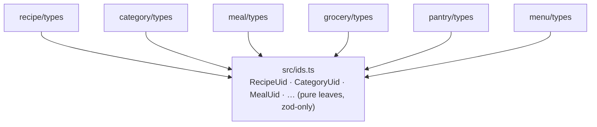

# ADR-0005: Composition-root shape, module structure, and identifier branding

**Status:** Proposed (2026-06-02)
**Last verified:** 2026-06-02

## Context

ADR-0001 shipped two transports over one composition root and recorded, honestly, that hand-wiring the context was "the emergent default, not a considered rejection of a container," deferring the real evaluation to [#197](https://github.com/bojanrajkovic/mcp-paprika/issues/197). This ADR is that evaluation. It bottoms out three questions that surfaced together, because the wiring model, the folder shape, and the identifier types co-determine each other: a choice on any one constrains the others.

The shape of the code today, verified against source:

- **The composition root is small.** `buildAppContext` + `buildMcpServer` total 445 lines in `src/server/build.ts`. `AppContext` is a flat 20-field record (`src/server/app-context.ts`); `buildMcpServer` makes 50 `register*` calls.
- **The construction-time dependency graph is wide and shallow.** All 12 in-memory stores take a single `pendingWriteTtlMs` scalar and depend on nothing else. The only fan-in nodes are `SyncEngine` (reads 11 stores plus client, cache, and notifier; `src/paprika/sync.ts:218` takes the whole `AppContext`), the vector store (recipe + category stores plus `sync.events`), and the auth context (the disk cache). Every cross-store relationship is a runtime lookup through the context, not a constructor dependency.
- **The bootstrap has one genuine cycle.** `AppContext` needs a `Notifier`; in stdio the `Notifier` needs the `McpServer`; the server is built from the `AppContext`. It is broken today with a closure over a mutable `let server` (`src/transport/stdio.ts`, `src/server/notifier.ts:35`).
- **The 20-field `AppContext` literal is written twice.** `build.ts:261` builds a placeholder with `vectorStore: null`, and `:346` rebuilds the full object; 18 of 20 fields are duplicated verbatim. Adding a store means editing both or it silently drops from one.
- **The data layer is almost completely decoupled across entities.** Branded UID schemas are used for each entity's own `uid`; foreign keys are stored as bare `z.string()` and resolved at runtime in the tool layer. There is exactly one exception: `recipe.categories` is a `CategoryUid[]`. No entity's type, store, or disk descriptor imports another entity's, save that single edge.
- **The unbranded foreign keys force casts.** Resolving an FK against its branded store requires an `as <Entity>Uid` assertion at every site (`meal-helpers.ts:274`, `meal-add-menu.ts:178`, `category-writes.ts`, `menu-item-write.ts`, `sync.ts:270`–`302`, and others). The cast is both ceremony and a type hole: it is unchecked, and because every UID is a shape-identical random UUID, a wrong-kind UID can never be caught at runtime. The compile-time brand is the only guard that exists, and the cast defeats it.

One constraint colors every identifier choice: the data is a cache of Paprika's Cloud Sync, an eventually-consistent source that does not guarantee referential integrity. A recipe may reference a deleted category (`CategoryStore.resolveNames` silently skips unknown UIDs), and a child entity may sync before its parent. The references here are soft by nature.

## Decision

Three linked decisions, sharing one idea: a small shared core (base classes, identifier brands) lets the data modules stay decoupled, while the genuinely cross-domain work (sync, persistence coordination, tool registration) stays central.

### 1. Composition root: a phase-typed builder, container deferred

Keep hand-wiring, refactored into a phase-typed builder. Defer a DI container behind an explicit, written trigger.

- **Break the cycle with an injectable `ServerRef` holder** instead of a closure over a `let`. `ServerRef` is a leaf with no dependencies, populated once after the server is built, so the graph stops being a cycle and becomes a DAG. This is also what makes the cycle expressible in a container later, if one is ever adopted.

  ```mermaid
  flowchart LR
    R["ServerRef<br/>(leaf, always exists)"]
    N["Notifier"] -->|"depends on"| R
    A["AppContext"] -->|"holds"| N
    S["McpServer"] -->|"built from"| A
    S -.->|"serverRef.set(server) once, after build"| R
  ```

- **Encode the bootstrap order in the type system.** Each phase returns a branded handle that exposes only the next legal step, so reordering is a compile error rather than a runtime surprise. The chain stays in one readable file.

  ```mermaid
  flowchart TB
    cfg["config · notifier · serverRef · log"] --> P1
    P1["authenticate()<br/>→ Authenticated"] --> P2["hydrate()<br/>→ Hydrated (disk cache + 12 stores)"]
    P2 --> P3["buildAuth()<br/>→ Wired (auth: null for stdio)"]
    P3 --> P4["wireSync()<br/>→ Synced (SyncEngine + sync:complete subscriber)"]
    P4 --> P5["runInitialSync()<br/>→ Indexed (syncOnce mutates stores)"]
    P5 --> P6["buildFeatures()<br/>→ Ready (vectorStore · photographyClient)"]
    P6 --> DONE["assemble()<br/>→ one AppContext + SyncEngine, built once"]
    P5 -.->|"temporal gate: buildFeatures needs an Indexed,<br/>which only runInitialSync can produce"| P6
  ```

- **Assemble `AppContext` exactly once** in the final phase, retiring the duplicated literal.
- **Narrow `SyncEngine` to a `SyncDeps` interface** that names only the stores, client, cache, and notifier it reads, instead of the whole `AppContext`. This is the one decoupling worth doing regardless of everything else, and it is the prerequisite for any later modularization.
- **Replace the 50 sequential `register*` calls with a `TOOL_REGISTRARS` array**, optional features expressed as a gate predicate, so a forgotten registration is a missing array entry rather than a silent omission.

A DI container is deferred, not rejected forever. The construction graph is a wide, shallow star, so there is no dependency tangle for a container to resolve; it would relabel the same explicit arguments as injection tokens without reducing them. More decisively, the hardest bootstrap constraint is not a dependency edge at all: the initial `syncOnce()` must run and mutate the category store _before_ the vector store indexes against it. That is a temporal side-effect ordering, which a container does not model and a phase-typed builder does. If a container is ever warranted (see the trigger in Consequences), the choice is `typed-inject`: fully compile-time typed, no decorators or `reflect-metadata`, the best fit for `@tsconfig/strictest`. awilix is rejected: its typed cradle is either a hand-written interface identical to `AppContext` or an inference blob that fights strict mode, and its scope and lazy-resolution features do not fit an eager-async, single-`AppContext` bootstrap.

### 2. Module structure: co-locate the data triple, keep coordinators central

Reorganize from technical layers to per-entity data modules over a shared core. Each entity owns its type, store, and disk descriptor:

```
src/
├── recipe/                 data module — self-contained
│   ├── types.ts            Recipe schemas    (imports ids.ts: UID brands only)
│   ├── store.ts            RecipeStore       (imports entity/: base class)
│   └── disk.ts             RecipeDiskCache   (imports cache: DiskCache<T>)
├── category/ meal/ menu/ grocery/ pantry/ aisle/ photo/   ← same shape
│
├── ids.ts                  shared leaf: every branded UID schema
├── entity/                 shared core: EntityStore / TombstoneEntityStore
├── cache/
│   ├── base.ts             generic DiskCache<T>, writeFileAtomic
│   └── root.ts             coordinator: imports each domain's disk descriptor, owns init()/flush()
├── server/                 composition root: phased builder, SyncEngine wiring, tool registry
└── tools/  resources/      cross-cutting: resolve FKs across stores at runtime
```

The data layer supports this cleanly: stores are independent, disk descriptors reference only their own schema, and types have a single cross-edge (recipe → category, which becomes recipe → `ids` once brands are hoisted). The shared core (`entity/` base classes, `src/ids.ts` brands, `cache/`'s `DiskCache<T>`) and the cross-cutting coordinators (`DiskCacheRoot`'s flush, `SyncEngine`, the composition root, tools, resources) stay central, because their jobs are inherently cross-domain.

Reject the fuller reshape in which domains own their tools. Seven tools span three or four stores (`meal-add-menu`, `grocery-item`), reference catalogs like `aisle` are shared across pantry and grocery, and `SyncEngine` is irreducibly global. Tools and sync are cross-cutting by nature; forcing them into domain folders would yield modules that import each other and still feed one global sync.

### 3. Identifiers: brand every foreign key, via a shared `ids` leaf

Resolve the branding drift toward safety. Brand every foreign key with its target's UID type, and hoist all UID brand schemas out of the entity types into a shared `src/ids.ts` leaf.



- **Branding is compile-time kind-safety.** The underlying strings are random UUIDs, so the brand carries no runtime signal today; it is informational at runtime and enforced only by the compiler. It still eliminates the `as <Entity>Uid` casts at resolution sites and prevents passing a `MenuUid` where a `RecipeUid` is wanted, which is the only safety the current design can offer.
- **Hoisting to a leaf is what keeps branding from re-coupling the data modules.** The brands are pure leaves (zod-only). Placing them in `src/ids.ts` means `meal/types.ts` imports `RecipeUidSchema` from `src/ids.ts`, not from `recipe/types.ts`, so every data module depends on the shared `ids` leaf and never on each other.
- **This is kind-safety, not referential integrity.** Branding does not assert the referenced entity exists; `store.get` still returns `undefined` for a dangling-but-well-typed UID, which is correct for a cache of an eventually-consistent source. Enforced foreign keys are deliberately not modeled, because the upstream cannot honor them.
- **No-regrets enabler.** Uniform branding now is the prerequisite for two futures and pays off whichever way each lands: a runtime-_enforced_ brand if Paprika round-trips non-UUID-shaped, brand-carrying identifiers (explored in [#202](https://github.com/bojanrajkovic/mcp-paprika/issues/202)), and, eventually, owning truly branded and FK-able stores once the data is no longer bound to Paprika's identifier scheme.
- **Standardize the brand definitions during the hoist.** Seven of twelve currently carry `.min(1)`; five do not. Pick one rule.

This folds into decision 2: the entity types are touched once, splitting `src/paprika/types.ts` into per-entity modules and extracting the brands to `src/ids.ts` in the same pass.

## Rejected alternatives

- **A DI container now (any).** The construction graph is a shallow star with no tangle to resolve, and the hardest constraint (temporal `syncOnce`-before-index ordering) is not a dependency edge a container models. `makeAppContext` + `seed()` are already a working typed factory at ~600 test call sites; a container would replace ~445 working lines with equivalent ceremony and still need `seed()`. Deferred behind the trigger below, not rejected forever.
- **awilix specifically.** Its typed cradle is either a hand-written interface identical to `AppContext` or an inference blob that fights `@tsconfig/strictest`; its scope and lazy features do not fit the eager-async, single-`AppContext` bootstrap. If a container is ever triggered, `typed-inject` is the pick.
- **Domains that own their tools.** Tools and `SyncEngine` are irreducibly cross-domain (multi-store tools, shared reference catalogs, a global sync). Domain-owned tools would import each other and still feed one sync engine: the cohesion of a layer dressed as a module.
- **Revert `recipe.categories` to an unbranded `string[]`.** This resolves the drift toward _less_ safety, adds `as CategoryUid` casts at recipe→category resolution sites, and discards the only compile-time guard available. The inconsistency should resolve toward branding, not away from it.
- **Brand foreign keys in place, without hoisting.** Branding while the brand schemas still live in each entity's `types.ts` re-couples the data modules into a web of inter-module imports, undoing decision 2. The shared `ids` leaf is what makes uniform branding and decoupling coexist.

This ADR also corrects two stale records: `src/server/CLAUDE.md` described the DI container as a "rejected … alternative," and ADR-0001 filed it under "Rejected alternatives" though its body said it was never weighed. Both are reconciled here. DI was deferred, is now deliberately evaluated, and hand-wiring with a phased builder is chosen for the current shape, with a container deferred behind a written trigger.

## Consequences

**Positive.**

- The load-bearing bootstrap order becomes a compile-time guarantee, not a comment; the duplicated `AppContext` literal disappears; a forgotten tool registration becomes a missing array entry.
- The data layer is organized by what changes together (an entity's type, store, and persistence) while the cross-domain coordinators stay where cross-domain logic belongs.
- Foreign keys are kind-safe and cast-free at every resolution site, restoring the only safety the random-UUID identifiers can carry today.
- All three decisions keep future options open and cheap: the per-domain folders are the shape autoload wants, `SyncDeps` is the seam any modularization needs, and branded IDs are ready for both [#202](https://github.com/bojanrajkovic/mcp-paprika/issues/202) and an eventual owned backend.

**Negative / costs.**

- A sizable mechanical diff: splitting `src/paprika/types.ts`, repointing imports across the tree, and touching the ~600 test call sites that reference moved modules. It is mechanical and the test suite catches breakage, but it is not small.
- The phase-typed builder is roughly six small phase types to define and maintain; that is the price of compile-checked ordering.
- `src/ids.ts` is a new shared dependency every data module imports. It is a leaf, so the coupling is shallow, but it is one more piece of the shared core.
- Branding gives kind-safety, not existence-safety; resolution sites still handle `undefined`. None of this work is visible to the end user; its entire payoff is engine maintainability and future optionality.

**Revisit trigger for the deferred container.** The triggers are deliberately structural, not a field count: a flat field total is a poor proxy for wiring complexity, so `AppContext` could grow well past today's 20 fields without a container helping. Adopt `typed-inject` only when one of these becomes true, and record the crossing:

1. The project splits into multiple packages or workspaces, where cross-package wiring starts to pay off.
2. The construction graph deepens (features depending on other features), giving a container a real graph to resolve.
3. A third transport or a per-request plugin surface appears, creating a scoping problem the current two-tier split does not cover.

Until then, the phased builder is the lighter, single-file, ordering-aware shape.

## References

- [ADR-0001](0001-two-transports-and-composition-root.md) — the two-transport composition root and the deferred DI question this ADR resolves.
- [#197](https://github.com/bojanrajkovic/mcp-paprika/issues/197) — the evaluation mandate.
- [#202](https://github.com/bojanrajkovic/mcp-paprika/issues/202) — runtime-enforced UID branding follow-up.
- `src/server/build.ts`, `src/server/app-context.ts`, `src/server/notifier.ts`, `src/paprika/sync.ts`, `src/paprika/types.ts` — the surfaces this ADR changes.
- `src/server/CLAUDE.md` — to be corrected (the "rejected … DI-container" phrasing).
