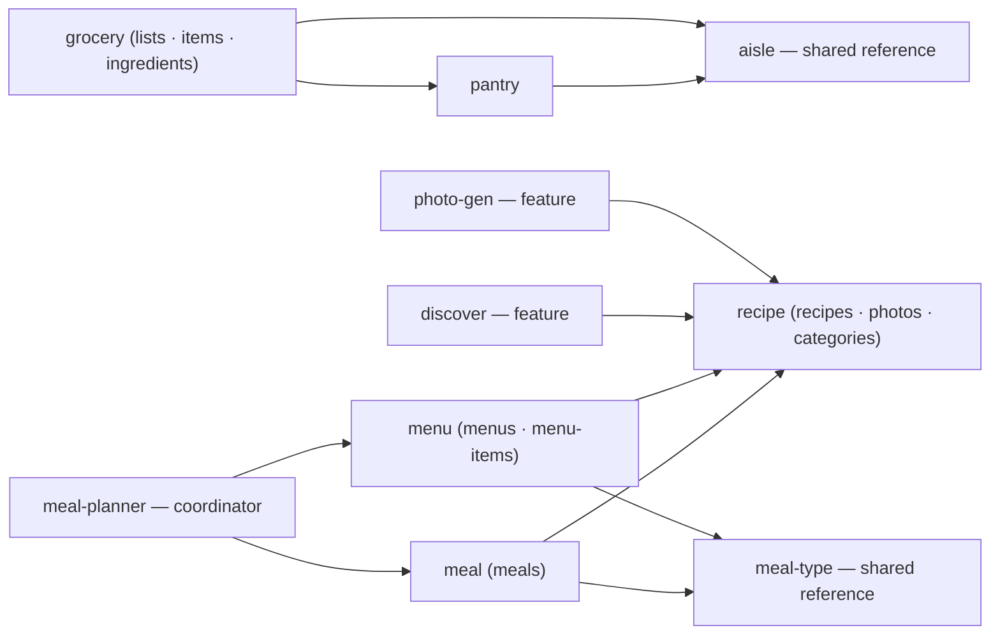

# ADR-0009: Domain-isolated tool modules via a typed composition kernel

**Status:** Accepted (2026-06-03)
**Last verified:** 2026-06-04
**Supersedes:** [ADR-0005](0005-composition-modules-and-identifiers.md) §1 (the phase-typed builder), and §2's rejection of domain-owned tools
**Reshapes:** [ADR-0001](0001-two-transports-and-composition-root.md)'s `SessionContext`
**Resolves:** [#212](https://github.com/bojanrajkovic/mcp-paprika/issues/212), [#215](https://github.com/bojanrajkovic/mcp-paprika/issues/215)

## Context

ADR-0005 reorganized the **data layer** into per-entity modules (`src/<entity>/{types,store,disk}.ts`) over a shared core, and deferred a DI container behind a written trigger. It deliberately left one boundary unmoved: the **tool layer**. Every tool and resource handler still closes over `SessionContext` — `AppContext` plus the session server — a flat ~20-field record exposing all twelve stores, the Paprika client, the disk cache, the vector index, and the logger. A `create_recipe` handler can read `pantryStore` or `menuStore` as easily as its own store. Domain boundaries at the tool layer are convention and directory placement, not anything the compiler enforces.

That ambient access is the gap. It costs no correctness today, but it scales badly: the tool surface is already large (dozens of registrations) and grows with every entity; the one genuine cross-entity edge (a recipe naming its categories) and the handful of cross-domain tools (a meal referencing a recipe and a meal-type, grocery resolving an aisle) are indistinguishable, in the type system, from a handler reaching into an unrelated store by accident. Least privilege is unexpressed, so a tool's blast radius is the whole god-object.

Three issues converge here at increasing ambition: **#212** wants entities to self-provide their store and disk cache, retiring the central descriptor import list; **#215** wants a plugin/module model in which domains declare their dependencies; and the standing question of **tool-layer isolation** wants a tool's reachable surface to be a compile-time consequence of what it declared it needs. They are three slices of one want, and one mechanism spans all three.

The constraints that bound the solution: `@tsconfig/strictest`; neverthrow in the core (no second error-handling paradigm); a `tsc → dist → node` build with no bundler; a load-bearing temporal ordering (the initial sync must populate the category store _before_ the vector index builds against it — ADR-0001, ADR-0005); and a data layer that is a cache of an eventually-consistent backend whose UID namespace this server does not own (ADR-0007).

## Decision

Introduce a small **typed composition kernel**. Each domain is a self-registering module that declares its dependencies and exposes a public contract; the kernel constructs the modules in dependency order, drives sync and boot-phase ordering, and hands each tool, resource, and hook a context **narrowed to its own internals (`state`) plus exactly its declared dependencies' contracts (`deps`)**, with the process-wide singletons in `infra`. (The internals seam was later split into pure `state` + a `writes` chokepoint surface — [ADR-0012](0012-pure-state-and-writes-seam.md).) Reaching an undeclared domain — or a declared domain's internals rather than its published contract — is a compile error.

This is one idea (turn the tool layer's ambient god-object into a declared, compile-enforced domain graph), resolved as three linked sub-decisions, each recoverable on its own.

### 1. Substrate: a bespoke typed kernel

The decisive axis is not "a plugin system" but **compile-time enforcement of a tool's reachable surface**. A bespoke kernel (~200 lines) is the only option that makes a tool's context type _equal to_ `state + declared deps` without a framework or a paradigm change. Self-registration is a declaration-merged registry interface that each module augments from its own file, so dependency contracts are typed from the registry, there is no central module list, and modules export nothing across boundaries. Authoring is a small curried builder that fixes a module's internals _before_ its tools are written, which is what lets every tool infer its narrowed context with no per-module type alias; the declared dependency tuple is the single source of truth for the `deps` a module's tools and hooks receive. Module discovery is a generated barrel of side-effect imports produced by a filesystem glob — no bundler, no compiler API. A boot pipeline sequences the side-effects the construction topo-sort cannot express (the initial sync runs before the vector index builds). One deliberate `as unknown as` cast lets the kernel iterate heterogeneous modules: the kernel is a type-agnostic transport that only shuttles values by string id, and all real safety lives at the tool and boot injection sites, which are fully checked.

### 2. Sync seam: per-module reconcile over a dumb driver

Background sync is the one subsystem that needs every store's write API, yet the kernel hides stores inside modules. Invert it: each module contributes one **sync contribution per owned entity** — a tier (`core` or `additive`), a reconcile step, and an optional end-of-cycle pending-write sweep — and the central engine becomes a dumb driver that flattens every module's contributions and sequences them: `core` reconciles first in dependency order (a failure aborts the cycle), `additive` ones each best-effort, then flush and sweep, the whole cycle never throwing. Each reconcile reaches its own store and cache via `state`, the client via `infra`, and siblings via `deps` — no central god-slice over the stores. The hard logic **moves without changing**: the recipe domain lifts the existing diff-and-fetch reconcile (pending-writes, observation-clearing) verbatim behind its own bespoke disk cache; replace-all entities call the unchanged shared helper.

### 3. Granularity and layout: domains, not entities

Collapse the twelve entity modules into roughly seven cohesive **domain** modules by one rule: _an entity folds into the domain that owns or solely references it; an entity referenced by two or more domains stays a standalone shared-reference catalog._

Edges are `dependsOn`; `auth` (HTTP-only) is a standalone module with no data edges. `aisle` and `meal-type` stay standalone because each is referenced by two domains (aisle by grocery and pantry; meal-type by meal and menu).

The source tree mirrors the graph: each domain lives at `src/domains/<domain>/` with a `module.ts` and `api.ts`, its defining entity's `{types,store,disk}.ts` at the domain root, and any additional owned entity in an `<entity>/` subdir (`src/domains/recipe/category/`, `src/domains/grocery/grocery-item/`, …). Tools, resources, and syncs are co-located subdirectories (`tools/`, `resources/`, `syncs/`) with their tests beside them — `src/tools/` and `src/resources/` are dissolved. Features stay at `src/features/<feature>/`; the kernel, composition root, cache, paprika client, and other infra stay at the `src/` root. The few genuinely cross-cutting tool helpers — the MCP `textResult` envelope, the uid-or-text lookup abstraction, and the SSRF-guarded image fetch — live at `src/shared/`, not in any one domain. Tools **and** resources register from the module by the identical mechanism — resources for Content domains only (recipe, grocery-list, menu — ADR-0004). Branded UID schemas follow ownership: each domain owns its entities' brands and imports a dependency's brand along the same `dependsOn` edge the kernel already requires (the brands are plain inlined `z.string().min(1).brand()` schemas — ADR-0007); a single shared `ids.ts` leaf is retained for now (#202) rather than scattering the brands per domain.

> **Later refinement (file granularity).** The per-domain file _granularity_ sketched above was subsequently tightened: a trivial `DiskCacheDescriptor` lives in the entity's `types.ts` (a dedicated `disk.ts` only for a behavior-carrying cache such as recipe's), and a single untested reconcile is a flat `sync.ts` rather than a one-file `syncs/` directory. This ADR's domain-isolation decision is unchanged; the current layout rule lives in `src/domains/CLAUDE.md` ("File granularity").

> **Later refinement (identifier location).** The central `ids.ts` leaf "retained for now" above was subsequently distributed: each domain declares its brands in its own `src/domains/<domain>/ids.ts` leaf (imports nothing but zod; one owning leaf per brand; conformance-gated), completing the brand-ownership rule this paragraph states — [ADR-0016](0016-per-domain-uid-leafs.md).

**Disk stays flat, reuse-in-place.** Each entity's `DiskCacheDescriptor` keeps its original flat `<cacheDir>/<entity>` subdir; the source move carries no on-disk change and therefore needs no data migration on deployed instances. This is a deliberate divergence from a `<cacheDir>/<domain>/<entity>/` namespacing: the only motivation for namespaced disk was "reset a domain as a unit," which no current operation needs, and the migration risk on a live cache is not worth buying a capability nothing uses. Revisit if a domain-granular reset ever becomes a real requirement.

## Rejected alternatives

### Substrate — Effect Layers

The strongest isolation model of the field: dependencies live in the type's `R` channel. Rejected because it is built around the Effect error monad, which would mean replacing neverthrow across the core — a paradigm rewrite far larger than the problem.

### Substrate — NestJS standalone context

`exports`/`imports` give compile-time module isolation. Rejected because it isolates _services_, not _tools_: MCP tool registration sits outside Nest's DI, so the very layer this decision is about would stay hand-wired and unisolated.

### Substrate — Fastify plugins

The best autoloading and self-registration story. Rejected because its isolation is **runtime only**: `decorate` is global augmentation and plugin dependencies are runtime-validated strings, so a decorated `mealStore` type-checks everywhere even where encapsulation hides it at runtime — it cannot make a tool's reachable surface a compile-time fact, which is the entire goal. (`typed-inject` and awilix are typed DI but offer no tool-context narrowing; awilix's `resolve()` is `any`.)

### Sync seam — collect facets, keep the engine (Option B)

Each module hands the kernel a `{ store, cache }` facet and the kernel reassembles the slice the existing engine already consumes, unchanged. Lowest risk to the most delicate code. Rejected because it keeps a central typed assembly that names all twelve entities and an engine that knows each one — exactly the god-list the kernel exists to delete.

### Granularity — keep entity-granular modules

Retain one module per entity. Rejected because the cross-domain tools and the shared reference catalogs make entity modules import one another; the domain is the unit that actually coheres, and only domain granularity dissolves `src/tools/` cleanly. This **revisits ADR-0005 §2**, which rejected domain-owned tools on the grounds that tools and sync are irreducibly cross-domain: the kernel removes that objection by making cross-domain access _declared_ (through `deps` contracts) and sync _contributed_ (to the dumb driver), rather than ambient.

## Consequences

**Positive.**

- A tool's reachable surface is least-privilege and compile-enforced; blast radius shrinks from the whole context to the declared dependency graph.
- "New domain = new folder": self-registration and per-module disk make #212 and #215 fall out, with no central registration list, duplicated `AppContext` literal, or `DiskCacheRoot` import block to edit.
- Sync decentralizes — the large engine becomes a sequencer, and each domain's reconcile sits beside the store it reconciles.
- Cross-cutting coupling becomes local: a domain that owns a parent and its children (grocery owns lists and items; menu owns menus and items) fires its own resource-change notification, with no central change-type table.

**Negative / costs.**

- Every domain must **design and maintain its public contract** — the read surface siblings depend on. That is real upfront work and ongoing discipline, the price of enforced boundaries.
- The kept `as unknown as` cast is sound but real: it is the one place the kernel trusts the author, accepted because eliminating it would require a source-parsing code generator that gives up "export nothing."
- `dependsOn` exhaustiveness is author-maintained: the dependency tuple and the contract it implies are both hand-written, and nothing forces a brand import to correspond to a declared edge without a boundary lint.
- Boot ordering moves from ADR-0005's phase types into the kernel's explicit boot phases; the temporal sync-before-index constraint becomes the driver's responsibility.
- The migration is a single long-lived branch (additive → flip → delete → reshape), with the risk concentrated in the flip commit (sync-to-notify wiring, boot ordering, and per-module store hydration — disk reuse-in-place means there is no on-disk migration to get wrong); the generated barrel must be regenerated when a domain is added, or that domain silently fails to register at runtime.

This **supersedes ADR-0005 §1**: the phase-typed builder is replaced by the kernel's dependency-ordered construction and boot phases. It **reshapes ADR-0001's `SessionContext`** — the per-handler god-object becomes the narrowed `DomainCtx` — while preserving ADR-0001's load-bearing core unchanged: two transports over one composition root, the transport-blind `Notifier` seam (now part of `infra`), and the invariant that process-wide context carries no server (the kernel's boot context has none; only the per-session context adds it). It resolves **#212** and **#215**.

Because each domain's data-sourcing sits private behind its contract, a domain's persistence could one day be reimplemented against a backend this server owns rather than projecting Paprika's — a question for that future, not this decision.

## References

- [ADR-0001](0001-two-transports-and-composition-root.md) — the two-transport composition root and `AppContext`/`SessionContext` split this reshapes.
- [ADR-0004](0004-tool-vs-resource-classification.md) — the tool-vs-resource classification that keeps resources Content-domain-only.
- [ADR-0005](0005-composition-modules-and-identifiers.md) — the data-layer modules and phase-typed builder this supersedes (§1) and revisits (§2, §3).
- [ADR-0007](0007-uid-branding-compile-time-only.md) — the compile-time UID branding and the owned-backend deferral this leaves intact.
- [#212](https://github.com/bojanrajkovic/mcp-paprika/issues/212) (self-registration) and [#215](https://github.com/bojanrajkovic/mcp-paprika/issues/215) (module model), resolved here; [#197](https://github.com/bojanrajkovic/mcp-paprika/issues/197) (the data-layer refactor mandate), now completed at the tool layer.
