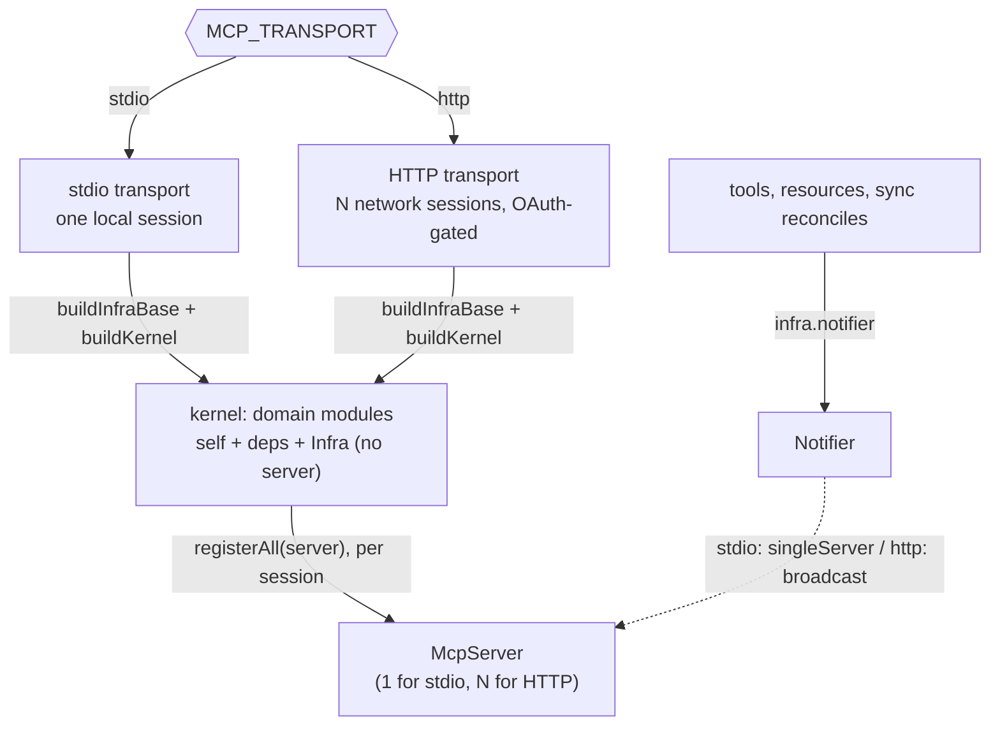
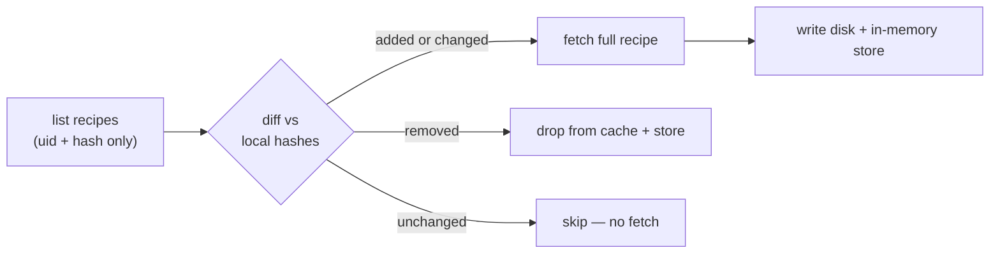
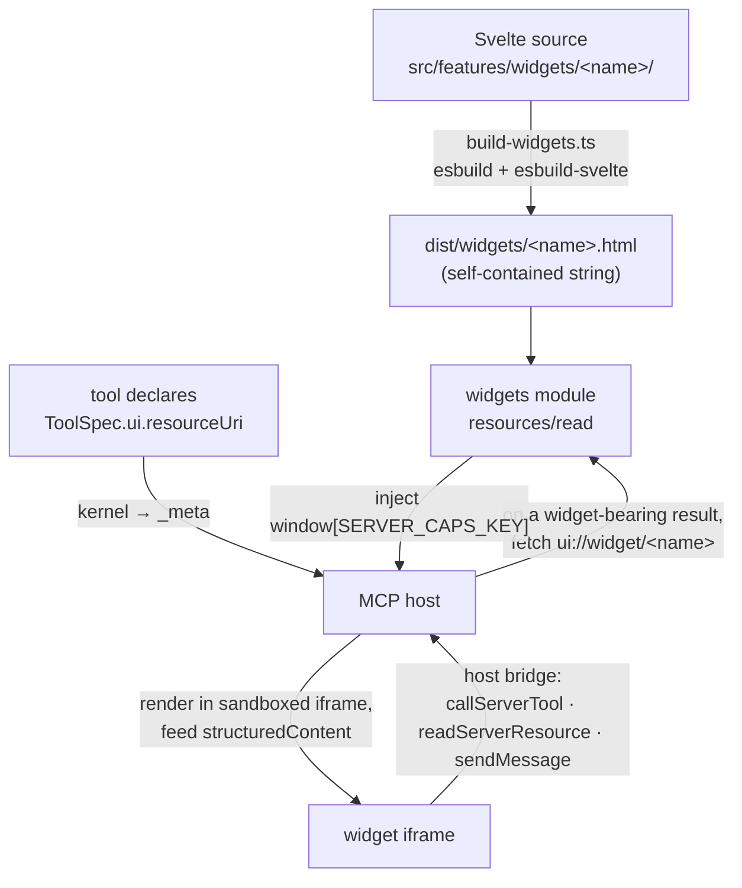

# Architecture

mcp-paprika bridges the Paprika recipe manager's cloud API to MCP clients. It keeps a local cache of the user's library, syncs it in the background, and exposes recipes, the pantry, grocery lists, meal planning, menus, and optional semantic search and AI photo generation as MCP tools and resources.

This covers the shape and the _why_. Current inventories (which tools exist, which stores, which config keys, the on-disk layout) are read from source and the per-directory `CLAUDE.md` files, not transcribed here; see the documentation map in the root `CLAUDE.md`. Decisions with weighed alternatives live in `docs/adr/`.

## One composition root, two transports

The business logic — every tool, resource, and sync step — is written once and is transport-agnostic, as a graph of self-registering **domain modules** over a typed composition **kernel** (`src/kernel/`). What differs between a local CLI client and a remote network client is only the framing, the number of concurrent sessions, and whether identity must be proven.

- Each **domain module** declares its dependencies and exposes a public contract. The kernel constructs the modules in dependency order and hands every tool, resource, and hook a context narrowed to its own state (`state`) and write chokepoints (`writes`), plus exactly its declared dependencies' contracts (`deps`); reaching an undeclared domain — or a declared one's internals rather than its published contract — is a compile error. Least privilege is enforced by the type system, not convention. See [ADR-0009](adr/0009-domain-isolated-tool-modules-kernel.md), [ADR-0012](adr/0012-pure-state-and-writes-seam.md), and `src/kernel/CLAUDE.md`.
- **`Infra`** is the universal seam every module receives: the Paprika client, the cache dir, the logger, the parsed config, the `Notifier`, the cross-entity index-event emitter, and the ephemeral generated-image store. It carries **no `server`** — nothing process-wide can reach "the server," which keeps process-wide state independent of how many sessions exist.
- **`buildKernel(infra)`** constructs every module (each hydrates its own disk cache, so "all built" means "all warm"), runs the initial sync cycle, runs the post-sync boot phases, and returns a per-session **`registerAll(server)`** that registers each module's tools and resources onto one `McpServer`: one server for the whole process under stdio, one per active session under HTTP.
- The **`Notifier`** (on `Infra`) is the seam that lets mutation code stay transport-blind: callers push resource-list-changed and logging notifications through `infra.notifier` rather than reaching a server, and the implementation (single-server vs. broadcast) is chosen by transport.

The two transports (`src/transport/`) are selected at startup by `MCP_TRANSPORT`. **stdio** is the default: a local, unauthenticated pipe where stdout _is_ the protocol, so stray output corrupts the wire. **Streamable HTTP** is a long-lived network service with per-session state, an OAuth surface, a readiness/liveness probe, and a Kubernetes-aware graceful drain. Both build the one kernel unchanged; only `buildInfraBase` (logger + authenticated client + cache dir, the credential fast-fail that stays outside the never-throws sync) and the per-session wiring differ. See [ADR-0001](adr/0001-two-transports-and-composition-root.md) (the two-transport split this reshapes) and [ADR-0009](adr/0009-domain-isolated-tool-modules-kernel.md) (the kernel).

## Caching and sync

Every Paprika entity family lives in two layers: an in-memory store that is the session's source of truth, backed by an atomic-write per-entity disk cache. Tools never touch the filesystem; they query the store, which is hydrated from disk at startup and kept fresh by background sync. That split keeps disk I/O off the hot path and tool code trivially testable, and the disk layer makes the server usable the instant it restarts: the cache is warm before the first sync returns, so a redeploy never leaves the user staring at a cold, empty library. See `src/cache/CLAUDE.md` (the store layer and, in its Persistence section, the disk layer).

The in-memory stores share a base rather than reimplementing the same bookkeeping a dozen times over. Each extends `EntityStore`, which carries the pending-writes map and the `hasSynced` flag so sync can skip reconciling a UID whose just-written local state hasn't yet round-tripped through Paprika. The plumbing was consolidated out of stores that once duplicated it, so a new entity family inherits it and adds only its own load side effects; the lone holdout is the grocery-ingredient store, keyed by name instead of UID, which needs none of it. The invariants that keep pending-writes correct under concurrent sync live in `src/entity/CLAUDE.md`. Deletes carry no in-memory state: outside recipe's `inTrash` soft-delete, every entity hard-deletes (the row is removed locally and vanishes from Paprika's lists), so a redundant delete returns a "may not exist or was already deleted" miss rather than tracking a tombstone. Each entity co-locates its schema, store, and disk descriptor with the domain that owns it under `src/domains/<domain>/` (a domain may own several entities — recipe owns recipes, categories, and photos), over that shared core (`src/entity/` base class, `src/cache/` persistence) and with its UID brands in the domain's own `ids.ts` leaf (see Identifiers below). Sync and the tool surface are no longer central coordinators: each domain contributes its own per-entity reconcile to a dumb kernel driver and registers its own tools and resources. See [ADR-0005](adr/0005-composition-modules-and-identifiers.md) for the original data-layer modules and [ADR-0009](adr/0009-domain-isolated-tool-modules-kernel.md) for the domain/kernel shape that supersedes it.

Sync runs once on startup (during `buildKernel`) and then optionally polls (the background loop in `src/server/sync-loop.ts`). Each domain contributes its own per-entity reconcile — a `ResultAsync` pipeline whose `err` is the failure signal ([ADR-0014](adr/0014-neverthrow-core-foreign-boundaries.md); a reconcile never throws) — which the kernel's dumb sync driver sequences across three tiers: reference catalogs (aisle, category, meal-type) first and best-effort, then core (recipe first, then the rest in dependency order; a core `err` aborts the cycle), then best-effort additive reads (meals, menus, photos). The tiers scope which reconciles a failure may abort, not data ordering — nothing reads a sibling store mid-reconcile (see [ADR-0010](adr/0010-reference-sync-tier.md)). The driver is **never-throws**: a failed cycle is logged and the loop continues. Two reconcile patterns coexist by entity:

- **Diff-and-fetch** (recipes). Paprika's sync endpoint returns only `{uid, hash}` pairs. The cache diffs those content hashes against what it holds and fetches full data only for what changed. An incremental sync of a 500-recipe library touches only the few recipes that actually moved: one list call plus a bounded number of detail fetches. This depends on the locally-computed recipe content hash being stamped on every write so cross-client edits are detectable; that algorithm is reverse-engineered and documented in [`docs/wire-format.md`](wire-format.md).
- **Replace-all** (categories and the other reference/collection families). Small enough to refetch wholesale.

After a cycle that changed an entity with a resource surface, sync fans a resource-list-changed notification through the `Notifier`; families with no resource surface (e.g. pantry) emit none.

## Identifiers

Every entity UID is a Zod-branded string. Branding is compile-time kind-safety only — at runtime each brand parses as a plain string, because the UID namespace is Paprika's, not ours — and the one runtime invariant every primary-key schema carries is non-emptiness (`.min(1)`). See [ADR-0007](adr/0007-uid-branding-compile-time-only.md). Each domain declares its own brands in a `src/domains/<domain>/ids.ts` leaf that imports nothing but `zod`, so a foreign key reads as an honest cross-domain import (meal's `types.ts` imports `../recipe/ids.js`) and a value-level import cycle through identifiers is structurally impossible; a conformance test enforces the leaf purity, one owning leaf per brand string, and that brands appear nowhere else ([ADR-0016](adr/0016-per-domain-uid-leafs.md)).

A foreign key that may be _absent_ spells that absence explicitly at the field, never through a min-less twin of the brand:

- a nullable FK is `XUidSchema.nullable()` (`null` = no reference);
- the grocery family's "no aisle" reference is the empty-string sentinel, named in `src/domains/aisle/ids.ts` as `NoAisleRef` / `AisleUidRef` (`NO_AISLE_UID` is its value);
- a required FK confirmed never-empty against the wire captures uses the strict schema directly (e.g. `photo.recipeUid`, `groceryItem.listUid`).

## Semantic search

Semantic discovery is optional: the `discover_recipes` tool is always registered, but when no embedding config is present it declines with an `isError` result pointing at `search_recipes` (the feature gate lives in the handler, not in registration — ADR-0009 §5). An OpenAI-compatible embedding client turns each recipe into a vector over its name, description, categories, ingredients, and notes (**directions and nutrition are deliberately excluded**, so editing cooking steps doesn't churn the index) and stores it in a vendored, file-backed cosine index. Re-indexing is hash-tracked and funneled through one chokepoint, so every local write and category rename re-embeds only what changed; an unchanged sync typically makes zero embedding calls. See `src/features/CLAUDE.md` and [ADR-0003](adr/0003-vendored-json-vector-index.md).

## Photos

The server reads and syncs recipe photos and can generate new ones. AI generation (`generate_recipe_photo`) is opt-in — the tool is always registered but declines when no image-generation client is configured — and produces a styled photo through an OpenRouter image model, normalized with sharp. `upload_recipe_photo` and the `generate_recipe_photo` preview return the normalized JPEG thumbnail as an image content block (ADR-0019 R2, `imageResult` in `src/shared/tools.ts`), so the person sees the attached or previewed photo inline rather than a bare text ack. Any server-side image fetch is SSRF-hardened (unicast-only address guard plus a DNS-rebinding-safe dispatcher), because the URL can be model- or user-influenced. See `src/features/CLAUDE.md`.

Reading photos back out goes through a proxy resource, `ui://recipe/{uid}/photo/{n}{?w,h}` (`src/domains/recipe/resources/photo-resource.ts`). It closes an asymmetry: a web-imported recipe carries a public `image_url`, but a user-**uploaded** photo has none — its bytes live in Paprika cloud storage behind sync auth, so nothing in the read surface could reach them. The resource resolves a recipe's cover photo (or an indexed gallery photo) server-side and serves its bytes, resizing to a requested `w`/`h` with sharp: the bytes come from a per-photo presigned URL fetched through the same SSRF-guarded `fetchImageBytes` (the two-step photo read is in [docs/wire-format.md](wire-format.md)), or from the source `image_url`/`photo_url` for a web-imported recipe. A proxy is the only path for a sandboxed widget iframe, whose CSP allows `data:`/same-origin only. The URI is surfaced additively as `photoResourceUri` on the browse rows, the `read_recipe` structured output, and the `paprika://recipe/{uid}` resource header — null when the recipe has no photo.

## Structured output channel

Every schema-bearing tool returns its result on **both** of MCP's channels carrying the **same payload**: `structuredContent` (the typed record the SDK validates and a widget renders) and the text block as **compact JSON** of that record. The text is the universal floor — it is the only channel guaranteed to reach the _model_ on every host, because whether a host forwards `structuredContent` to the model (as opposed to only to a widget iframe) is a per-host choice the server cannot detect at the handshake: Claude Code and ChatGPT-in-chat surface it to the model, Claude Desktop hands the model only the text. `structuredResult(structured)` in `src/shared/tools.ts` builds both halves from one payload (`toolResult(text, structured)` is the underlying primitive, kept for the few callers that pass explicit text); a tool that returns one declares the shape as `ToolSpec.outputSchema`, which the SDK advertises in `tools/list`. There is one source of truth — the structured payload — so the per-tool Markdown view that once drifted from it (and dropped the UIDs the model needs) is gone. The human-facing `paprika://` resources keep their Markdown rendering: they are read directly by a person, not fed to a model. See [ADR-0023](adr/0023-json-or-widget-tool-results.md). Which hosts actually forward `structuredContent` to the model is observed on the live surface — the client fingerprint each host advertises at connect (captured as telemetry), with forwarding established empirically per host — and maintained as a host → forwarding matrix; see [ADR-0024](adr/0024-client-connection-fingerprint.md).

Declaring a schema is a contract over a tool's whole result space, because the SDK's `validateToolOutput` requires a valid `structuredContent` on every result it considers non-error (and validates it against the schema, rejecting the call otherwise) but returns early on an `isError` result. So a schema-bearing tool sorts its branches in two: a **successful answer — including an empty one** (no meals in the window, a never-cooked recipe) — returns `structuredResult(structured)` carrying a valid (possibly empty) payload on both channels; an **in-handler non-success branch** — an unknown UID, an unparseable argument — returns `errorResult(text)` (the `isError` half of the channel, also in `src/shared/tools.ts`), which the SDK exempts so its friendly message and remediation hint survive rather than being replaced by a generic schema error. A **precondition-gate** failure is exempt automatically: a guard returns a plain `toolResult` and the kernel marks every gate failure `isError` (`src/kernel/tool.ts`), so guards never need to know which tools declare a schema. That keeps "found nothing" (a real empty result the model should accept) distinct from "your input was wrong / I am not ready" (which the model must not parse as data). The contract is pinned over the real transport in `src/kernel/tool.e2e.test.ts`. The uid-or-text lookup reads apply this split through the shared `resolveOrPick` / `formatLookupOutcome` seam (`src/shared/tools.ts`): a `uid_miss` / `text_none`, or a `text_many` whose disambiguation PICK is declined or unavailable, returns an `errorResult` carrying a `findWith` remediation hint — the discovery verb that resolves the miss (`search_recipes`, `list_menus`) — so a not-found never reaches the success channel a schema-bearing read validates. The read's happy arm resolves the entity once through the same seam's `resolveOrPick` and projects it to the structured payload, so the JSON text and `structuredContent` derive from one resolved entity. A write tool that echoes a created entity emits its payload inline, and its commit-divergence branch (`commitFailure`, given the just-saved entity's `structuredContent`) stays a non-error success — a local-cache failure after a successful Paprika write must not read as an `isError` the model would retry.

The conformance test (`test/conformance/structured-output-envelope.test.ts`) pins the exact set of schema-bearing tools. A tool carries `structuredContent` + `outputSchema` when its result returns a **resolvable entity a follow-up could key on** — one it reads (the reads and lists), mints (creators / movers like `plan_meals`, `log_cooked_meal`, `schedule_menu`, `move_grocery_items_to_pantry`), or echoes (the mutating write-acks). An ack whose entity is one row of a larger container echoes the whole container — a menu-item edit or move echoes the parent menu, a catalog rename (`update_aisle` / `update_meal_type` / `update_category`) echoes the full reordered `list_*` payload. A tool that returns **nothing resolvable** — a delete, a clear, `purge_recipe` — carries neither and returns a plain `toolResult` acknowledgement ([ADR-0021](adr/0021-reliable-structured-content-channel.md) sets this rule). Because the JSON text carries the same payload, the machine UIDs the model chains on reach it on every host — closing the gap a host that withholds `structuredContent` from the model (Claude Desktop) would otherwise open, e.g. `read_recipe → cook_recipe`. The photo tools (`upload_recipe_photo` / `generate_recipe_photo`) are the one carve-out: their human view is the inline image block, and their text caption already carries the chainable UID, so they keep that caption rather than a JSON body. Where the old Markdown text carried _call-specific_ advisory data the structured payload lacked — a batch-add's duplicate-skip notices, with the existing UID + a merge hint — that data is now a field on the payload (`skipped` on `add_pantry_items` / `add_grocery_items` / `add_recipe_to_grocery_list`); purely display-only or model-derivable extras (an unverified-time caveat, an unknown-category warning, an orphan-category note, a meal-type export schedule) are dropped. See [ADR-0019](adr/0019-mcp-app-widget-surface.md) and [ADR-0023](adr/0023-json-or-widget-tool-results.md).

## Elicitation gates

Two spec-native interactions read off the per-session client rather than a widget (ADR-0020). A **disambiguation PICK** fires when a fuzzy uid-or-text lookup matches several entities: `resolveOrPick` (`src/shared/tools.ts`) asks the user to choose one through MCP form elicitation instead of returning a "multiple matches" list. A **CONFIRM** gates a high-cost destructor — an irreversible or bulk/cascade delete, or one behind an opaque identifier (a `purge_recipe`, a `clear_*`) — via `confirmOrCancel`, which the handler runs after it resolves the target and passes its refusal checks, before the write; a decline returns a plain "Cancelled" result.

Both are **fail-open**: elicitation is a client capability, so the shared primitive (`confirmGate` / `pickOne` in `src/shared/elicit.ts`) reads `ctx.server.server`'s advertised capability before issuing a request and treats any throw as "unsupported" — a CONFIRM then proceeds (the host's own tool-approval prompt is the backstop, which a capable client can set to always-allow) and a PICK falls back to an `isError` disambiguation list. The gate is a human checkpoint where the client can show one, never a hard requirement that breaks the tool elsewhere. The cost-of-mistake test for which destructors gate, and why fail-open beat fail-closed, is [ADR-0020](adr/0020-fail-open-elicitation-gates.md).

## Widget surface

Some results are better tapped than read — a grocery checklist, a recipe card, a cooking step view. A tool can declare `ToolSpec.ui = { resourceUri: "ui://widget/{name}" }`, which the kernel maps onto the advertised tool's `_meta` (both the nested `_meta.ui.resourceUri` the apps surface reads and the legacy flat key, mirroring `@modelcontextprotocol/ext-apps`'s `registerAppTool`). A host that supports the MCP apps surface fetches that `ui://` resource and renders its HTML in a sandboxed iframe, feeding the tool's structured payload in and carrying actions back out; a host without it ignores the `_meta` and shows the text result, so the surface is additive.

Each widget's Svelte source lives at `src/features/widgets/<name>/`; `scripts/build-widgets.ts` (esbuild + esbuild-svelte, part of `pnpm build`) compiles each into one self-contained `dist/widgets/<name>.html` with the Svelte runtime, the component CSS, and the ext-apps browser runtime all inlined — so the iframe fetches nothing and the apps SDK stays a build-time-only devDependency (the server reads the finished HTML as a string; a CI job proves a `--prod` prune still serves them). esbuild strips types without checking, so the browser source is type-checked separately by `svelte-check` against `tsconfig.widgets.json`, folded into `pnpm typecheck`; a dev-only, config-gated `/widget-preview` route (`MCP_WIDGET_PREVIEW`, see [http-transport.md](http-transport.md)) renders a built widget against a fake host shim that feeds it a `?payload=` as `structuredContent`.

The `widgets` feature module (`src/features/widgets/`) registers the `ui://widget/{name}` resource and serves those prebuilt strings, loaded once at construction. The injection seam is the `resources/read`: the handler stamps the **per-session** server capabilities into `window[SERVER_CAPS_KEY]` as it serves the HTML, so each client gets a widget reflecting its own negotiated session (e.g. whether elicitation is available). It also smuggles the read span's W3C traceparent into `window[__MCP_TRACEPARENT__]`, so the widget can report its client-side render timeline back through the **app-only** `record_widget_timing` tool (`ui.visibility: ["app"]`, hidden from the model); the server re-parents those render marks as child spans of the read, grouped to the turn by `mcp.session.id` — durable widget trace continuity, an enhancement to [ADR-0018](adr/0018-opentelemetry-instrumentation.md). From inside the iframe a widget talks back through one host bridge (`src/features/widgets/shared/host-bridge.ts`): `callServerTool` drives a follow-up tool (a tap, a navigation re-fetch), `readServerResource` pulls a resource (the `ui://recipe/{uid}/photo` bytes into a `data:` URI), and `app.sendMessage` hands work the widget can't do itself back to the assistant. Which widgets exist and what each renders is read from those source dirs, not catalogued here.

Most widget feeds are **server-derived** — a tool reads Paprika data and emits the structured payload the widget renders. The step-anchored cooking widget (`cook_recipe`) is the exception: its feed is **model-authored**. Paprika stores a recipe's ingredients and directions as two unrelated free-text blobs with no link between them, so the per-step ingredient anchoring the surface needs cannot be derived server-side — the server has no language model, and string matching fails on the cases that matter (category references like "the dry ingredients", intermediates with no raw line to point at, quantities split across steps). The assistant instead parses the recipe (after `read_recipe`) and passes the anchored structure to `cook_recipe`, which **validates and enriches, never derives**: it checks internal consistency with no model — the `recipe_uid` resolves, refs are in range, every intermediate is produced by an earlier step, produces names are unique — returning a remediation hint on each failure, and enriches the echo with the stored recipe's identity (name, servings, total time, photo resource). Intermediates are first-class: a step that sets aside a sub-component (a spice paste, a baked crust) names it via `produces`, and later steps consume it by name via `usesIntermediate`. This is a different trust model from every other widget — its correctness rests on the model plus a human confirm/adjust pass in the widget, not on server-derived truth. See [ADR-0022](adr/0022-model-sourced-widget-feed.md).

The widgets share a toolkit and theme system under `src/features/widgets/shared/`: `WidgetShell` is the canonical home of the theme tokens (a warm-neutral palette that flips on a `dark` class and cascades to every descendant through inherited CSS custom properties) plus the outer layout, over a set of shared chrome components and the `host-bridge` / `host-style` / `motion` helpers; each widget keeps only its divergent controls local. Typography is host-matched, not fixed: `host-style.ts` adopts the host's ext-apps style tokens (`applyHostStyleVariables` / `applyHostFonts`) and resolves the widget typeface — a serif stack for a serif-first host like Claude, the host's `--font-sans` otherwise. The visual layer is a design system shared with the OAuth consent screen (`src/auth/consent-page.ts`), recorded in `PRODUCT.md` (strategic register), `DESIGN.md` (the visual system), and `.impeccable/design.json` (its machine-readable sidecar). See [ADR-0019](adr/0019-mcp-app-widget-surface.md) and `src/features/widgets/CLAUDE.md`.

## Authentication

Under stdio there is no auth surface: the OS process boundary is the trust boundary. Under HTTP the server is a full OAuth 2.1 authorization server toward MCP clients while delegating identity to one operator-configured upstream OIDC provider, minting its own opaque tokens and admitting only an allowlisted set of users. The entire `src/auth/` surface loads only when the transport is HTTP. See [ADR-0002](adr/0002-oauth21-oidc-delegation.md) and `src/auth/CLAUDE.md`.

## Cross-cutting concerns

**Logging.** One process-wide pino logger lives on `Infra`; components take children scoped by name. A credential-redaction policy strips secrets, and records at or above the notify level fan out to connected MCP clients through the same `Notifier` seam. The bootstrap is order-sensitive (the notifier is built first around a deferred getter so startup records have somewhere to go before the server exists); `src/server/CLAUDE.md` and `src/utils/CLAUDE.md` carry the details.

**Resilience.** The Paprika client and the embedding/photography clients share one cockatiel executor: exponential-backoff retry on transient HTTP failures plus a consecutive-failure circuit breaker. Recipe detail fetches run under a bounded, configurable concurrency so sync stays courteous to the API. Startup authentication is retried but deliberately not circuit-broken (a one-shot path where a real credential rejection should fail fast). The tuning values are config, not prose; see `docs/configuration.md` and `src/utils/resilience.ts`.

**Telemetry.** OpenTelemetry traces and metrics, opt-in by OTLP endpoint and off by default ([ADR-0018](adr/0018-opentelemetry-instrumentation.md)). Recording rides the global OTel API at the seams the architecture already concentrates behavior into — the `defineTool` wrapper, the resource-read helper, the sync driver, the Paprika client's request chokepoint, the shared resilience executor, the commit-adjacent notifier/index-event seams, and each transport's `initialize` handshake (the per-session client fingerprint — clientInfo, capabilities, protocol version — recorded once and used to tag the session's tool spans, [ADR-0024](adr/0024-client-connection-fingerprint.md)) — following the MCP/GenAI semantic conventions (vendored, Development-status) with custom names under an `mcp_paprika.` prefix. One bootstrap module loads via `--import` in the container (ESM loader hook effective) and as `src/index.ts`'s first import for the npm bin; in stdio mode nothing telemetry-related may touch stdout (OTLP-only exporters, stderr diag). Span status in the neverthrow core derives from `Result` arms, not exceptions. The operator guide is [`docs/telemetry.md`](telemetry.md).

**Error handling.** Code we own returns neverthrow `Result<T, E>` and never throws to signal an expected outcome; a `throw` survives only in a few recognized forms that either speak a foreign throw-based protocol or assert the unreachable — a resource not-found crossing to the MCP SDK, the OAuth error types the SDK's authorization-server router renders, the cockatiel transient-retry marker, an `assertNever` exhaustiveness guard, and fail-fast at process entry and kernel construction. The libraries that genuinely throw — `fetch`, the filesystem, `jose`, `sharp`, cockatiel — are caught at the owning wrapper's edge and converted to a `Result` there, so the pure core stays total and composable while the messy edges are contained where they happen. See [ADR-0014](adr/0014-neverthrow-core-foreign-boundaries.md).

## Key decisions

The decisions with weighed alternatives are recorded as ADRs: two transports over one composition root ([0001](adr/0001-two-transports-and-composition-root.md)), OAuth 2.1 with OIDC delegation ([0002](adr/0002-oauth21-oidc-delegation.md)), the owned JSON vector index ([0003](adr/0003-vendored-json-vector-index.md)), the tool-vs-resource classification ([0004](adr/0004-tool-vs-resource-classification.md)), the composition-root shape, per-entity module structure, and identifier branding ([0005](adr/0005-composition-modules-and-identifiers.md)), test fixtures out of `src` ([0006](adr/0006-test-fixtures-out-of-src.md)), compile-time-only UID branding ([0007](adr/0007-uid-branding-compile-time-only.md)), the tool surface as a forward-intent command language ([0008](adr/0008-tool-surface-command-language.md)), the domain-isolated module/kernel architecture ([0009](adr/0009-domain-isolated-tool-modules-kernel.md)), the reference sync tier ([0010](adr/0010-reference-sync-tier.md)), tool specs as data for boot-free doc generation ([0011](adr/0011-tool-specs-as-data.md)), the pure-state interface and `ctx.writes` chokepoint seam ([0012](adr/0012-pure-state-and-writes-seam.md)), the test pyramid and tiers ([0013](adr/0013-test-pyramid-and-tiers.md)), neverthrow in the core with throws only at foreign boundaries ([0014](adr/0014-neverthrow-core-foreign-boundaries.md)), the precondition-chain `defineTool` ([0015](adr/0015-precondition-chain-definetool.md)), and per-domain UID identifier leafs ([0016](adr/0016-per-domain-uid-leafs.md)).

A few smaller choices shape the code without rising to an ADR:

- **In-memory stores over a disk cache** keep disk I/O off the hot path and tools testable; the stable store API leaves SQLite as a future escape hatch if the in-memory working set ever stops fitting.[^sqlite]
- **A single shared resilience executor** rather than per-client retry/breaker logic, so the policy is defined once.
- **One pino root threaded through `Infra`**, so every component logs through the same redaction and fan-out path rather than each re-discovering "the server."

[^sqlite]: It hasn't stopped fitting, and it won't soon: a few thousand recipes is a rounding error in RAM. The escape hatch is insurance, not a plan.
