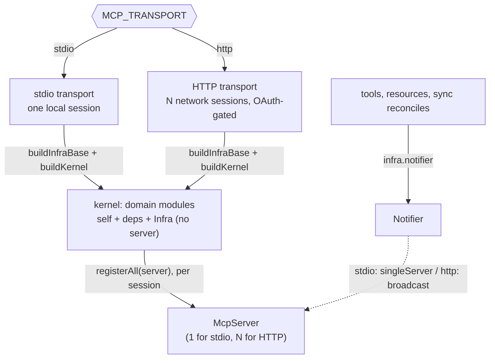
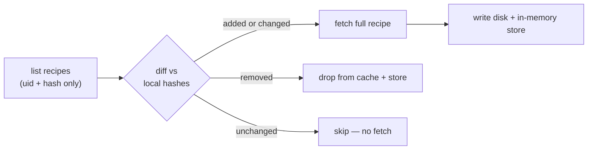

# Architecture

Last verified: 2026-06-04

mcp-paprika bridges the Paprika recipe manager's cloud API to MCP clients. It keeps a local cache of the user's library, syncs it in the background, and exposes recipes, the pantry, grocery lists, meal planning, menus, and optional semantic search and AI photo generation as MCP tools and resources.

This covers the shape and the _why_. Current inventories (which tools exist, which stores, which config keys, the on-disk layout) are read from source and the per-directory `CLAUDE.md` files, not transcribed here; see the documentation map in the root `CLAUDE.md`. Decisions with weighed alternatives live in `docs/adr/`.

## One composition root, two transports

The business logic — every tool, resource, and sync step — is written once and is transport-agnostic, as a graph of self-registering **domain modules** over a typed composition **kernel** (`src/kernel/`). What differs between a local CLI client and a remote network client is only the framing, the number of concurrent sessions, and whether identity must be proven.

- Each **domain module** declares its dependencies and exposes a public contract. The kernel constructs the modules in dependency order and hands every tool, resource, and hook a context narrowed to its own state (`state`) and write chokepoints (`writes`), plus exactly its declared dependencies' contracts (`deps`); reaching an undeclared domain — or a declared one's internals rather than its published contract — is a compile error. Least privilege is enforced by the type system, not convention. See [ADR-0009](adr/0009-domain-isolated-tool-modules-kernel.md), [ADR-0012](adr/0012-pure-state-and-writes-seam.md), and `src/kernel/CLAUDE.md`.
- **`Infra`** is the universal seam every module receives: the Paprika client, the cache dir, the logger, the parsed config, the `Notifier`, the cross-entity index-event emitter, and the ephemeral generated-image store. It carries **no `server`** — nothing process-wide can reach "the server," which keeps process-wide state independent of how many sessions exist.
- **`buildKernel(infra)`** constructs every module (each hydrates its own disk cache, so "all built" means "all warm"), runs the initial sync cycle, runs the post-sync boot phases, and returns a per-session **`registerAll(server)`** that registers each module's tools and resources onto one `McpServer`: one server for the whole process under stdio, one per active session under HTTP.
- The **`Notifier`** (on `Infra`) is the seam that lets mutation code stay transport-blind: callers push resource-list-changed and logging notifications through `infra.notifier` rather than reaching a server, and the implementation (single-server vs. broadcast) is chosen by transport.

The two transports (`src/transport/`) are selected at startup by `MCP_TRANSPORT`. **stdio** is the default: a local, unauthenticated pipe where stdout _is_ the protocol, so stray output corrupts the wire. **Streamable HTTP** is a long-lived network service with per-session state, an OAuth surface, a readiness/liveness probe, and a Kubernetes-aware graceful drain. Both build the one kernel unchanged; only `buildInfraBase` (logger + authenticated client + cache dir, the credential fast-fail that stays outside the never-throws sync) and the per-session wiring differ. See [ADR-0001](adr/0001-two-transports-and-composition-root.md) (the two-transport split this reshapes) and [ADR-0009](adr/0009-domain-isolated-tool-modules-kernel.md) (the kernel).

## Caching and sync

Every Paprika entity family lives in two layers: an in-memory store that is the session's source of truth, backed by an atomic-write per-entity disk cache. Tools never touch the filesystem; they query the store, which is hydrated from disk at startup and kept fresh by background sync. That split keeps disk I/O off the hot path and tool code trivially testable, and the disk layer makes the server usable the instant it restarts: the cache is warm before the first sync returns, so a redeploy never leaves the user staring at a cold, empty library. See `src/cache/CLAUDE.md` (the store layer and, in its Persistence section, the disk layer).

The in-memory stores share a base rather than reimplementing the same bookkeeping a dozen times over. Each extends `EntityStore`, which carries the pending-writes map and the `hasSynced` flag so sync can skip reconciling a UID whose just-written local state hasn't yet round-tripped through Paprika. The plumbing was consolidated out of stores that once duplicated it, so a new entity family inherits it and adds only its own load side effects; the lone holdout is the grocery-ingredient store, keyed by name instead of UID, which needs none of it. The invariants that keep pending-writes correct under concurrent sync live in `src/entity/CLAUDE.md`. Deletes carry no in-memory state: outside recipe's `inTrash` soft-delete, every entity hard-deletes (the row is removed locally and vanishes from Paprika's lists), so a redundant delete returns a "may not exist or was already deleted" miss rather than tracking a tombstone. Each entity co-locates its schema, store, and disk descriptor with the domain that owns it under `src/domains/<domain>/` (a domain may own several entities — recipe owns recipes, categories, and photos), over that shared core (`src/entity/` base class, `src/ids.ts` UID brands, `src/cache/` persistence). Sync and the tool surface are no longer central coordinators: each domain contributes its own per-entity reconcile to a dumb kernel driver and registers its own tools and resources. See [ADR-0005](adr/0005-composition-modules-and-identifiers.md) for the original data-layer modules and [ADR-0009](adr/0009-domain-isolated-tool-modules-kernel.md) for the domain/kernel shape that supersedes it.

Sync runs once on startup (during `buildKernel`) and then optionally polls (the background loop in `src/server/sync-loop.ts`). Each domain contributes its own per-entity reconcile — a `ResultAsync` pipeline whose `err` is the failure signal ([ADR-0014](adr/0014-neverthrow-core-foreign-boundaries.md); a reconcile never throws) — which the kernel's dumb sync driver sequences across three tiers: reference catalogs (aisle, category, meal-type) first and best-effort, then core (recipe first, then the rest in dependency order; a core `err` aborts the cycle), then best-effort additive reads (meals, menus, photos). The tiers scope which reconciles a failure may abort, not data ordering — nothing reads a sibling store mid-reconcile (see [ADR-0010](adr/0010-reference-sync-tier.md)). The driver is **never-throws**: a failed cycle is logged and the loop continues. Two reconcile patterns coexist by entity:

- **Diff-and-fetch** (recipes). Paprika's sync endpoint returns only `{uid, hash}` pairs. The cache diffs those content hashes against what it holds and fetches full data only for what changed. An incremental sync of a 500-recipe library touches only the few recipes that actually moved: one list call plus a bounded number of detail fetches. This depends on the locally-computed recipe content hash being stamped on every write so cross-client edits are detectable; that algorithm is reverse-engineered and documented in [`docs/wire-format.md`](wire-format.md).
- **Replace-all** (categories and the other reference/collection families). Small enough to refetch wholesale.

After a cycle that changed an entity with a resource surface, sync fans a resource-list-changed notification through the `Notifier`; families with no resource surface (e.g. pantry) emit none.

## Semantic search

Semantic discovery is optional: it registers the `discover_recipes` tool only when embedding config is present. An OpenAI-compatible embedding client turns each recipe into a vector over its name, description, categories, ingredients, and notes (**directions and nutrition are deliberately excluded**, so editing cooking steps doesn't churn the index) and stores it in a vendored, file-backed cosine index. Re-indexing is hash-tracked and funneled through one chokepoint, so every local write and category rename re-embeds only what changed; an unchanged sync typically makes zero embedding calls. See `src/features/CLAUDE.md` and [ADR-0003](adr/0003-vendored-json-vector-index.md).

## Photos

The server reads and syncs recipe photos and can generate new ones. AI generation (`generate_recipe_photo`) is opt-in (registered only when an image-generation client is configured) and produces a styled photo through an OpenRouter image model, normalized with sharp. Any server-side image fetch is SSRF-hardened (unicast-only address guard plus a DNS-rebinding-safe dispatcher), because the URL can be model- or user-influenced. See `src/features/CLAUDE.md`.

## Authentication

Under stdio there is no auth surface: the OS process boundary is the trust boundary. Under HTTP the server is a full OAuth 2.1 authorization server toward MCP clients while delegating identity to one operator-configured upstream OIDC provider, minting its own opaque tokens and admitting only an allowlisted set of users. The entire `src/auth/` surface loads only when the transport is HTTP. See [ADR-0002](adr/0002-oauth21-oidc-delegation.md) and `src/auth/CLAUDE.md`.

## Cross-cutting concerns

**Logging.** One process-wide pino logger lives on `Infra`; components take children scoped by name. A credential-redaction policy strips secrets, and records at or above the notify level fan out to connected MCP clients through the same `Notifier` seam. The bootstrap is order-sensitive (the notifier is built first around a deferred getter so startup records have somewhere to go before the server exists); `src/server/CLAUDE.md` and `src/utils/CLAUDE.md` carry the details.

**Resilience.** The Paprika client and the embedding/photography clients share one cockatiel executor: exponential-backoff retry on transient HTTP failures plus a consecutive-failure circuit breaker. Recipe detail fetches run under a bounded, configurable concurrency so sync stays courteous to the API. Startup authentication is retried but deliberately not circuit-broken (a one-shot path where a real credential rejection should fail fast). The tuning values are config, not prose; see `docs/configuration.md` and `src/utils/resilience.ts`.

**Error handling.** Code we own returns neverthrow `Result<T, E>` and never throws to signal an expected outcome; a `throw` survives only in a few recognized forms that either speak a foreign throw-based protocol or assert the unreachable — a resource not-found crossing to the MCP SDK, the OAuth error types the SDK's authorization-server router renders, the cockatiel transient-retry marker, an `assertNever` exhaustiveness guard, and fail-fast at process entry and kernel construction. The libraries that genuinely throw — `fetch`, the filesystem, `jose`, `sharp`, cockatiel — are caught at the owning wrapper's edge and converted to a `Result` there, so the pure core stays total and composable while the messy edges are contained where they happen. See [ADR-0014](adr/0014-neverthrow-core-foreign-boundaries.md).

## Key decisions

The decisions with weighed alternatives are recorded as ADRs: two transports over one composition root ([0001](adr/0001-two-transports-and-composition-root.md)), OAuth 2.1 with OIDC delegation ([0002](adr/0002-oauth21-oidc-delegation.md)), the owned JSON vector index ([0003](adr/0003-vendored-json-vector-index.md)), the tool-vs-resource classification ([0004](adr/0004-tool-vs-resource-classification.md)), the composition-root shape, per-entity module structure, and identifier branding ([0005](adr/0005-composition-modules-and-identifiers.md)), test fixtures out of `src` ([0006](adr/0006-test-fixtures-out-of-src.md)), compile-time-only UID branding ([0007](adr/0007-uid-branding-compile-time-only.md)), the tool surface as a forward-intent command language ([0008](adr/0008-tool-surface-command-language.md)), the domain-isolated module/kernel architecture ([0009](adr/0009-domain-isolated-tool-modules-kernel.md)), the reference sync tier ([0010](adr/0010-reference-sync-tier.md)), tool specs as data for boot-free doc generation ([0011](adr/0011-tool-specs-as-data.md)), the pure-state interface and `ctx.writes` chokepoint seam ([0012](adr/0012-pure-state-and-writes-seam.md)), the test pyramid and tiers ([0013](adr/0013-test-pyramid-and-tiers.md)), and neverthrow in the core with throws only at foreign boundaries ([0014](adr/0014-neverthrow-core-foreign-boundaries.md)).

A few smaller choices shape the code without rising to an ADR:

- **In-memory stores over a disk cache** keep disk I/O off the hot path and tools testable; the stable store API leaves SQLite as a future escape hatch if the in-memory working set ever stops fitting.[^sqlite]
- **A single shared resilience executor** rather than per-client retry/breaker logic, so the policy is defined once.
- **One pino root threaded through `Infra`**, so every component logs through the same redaction and fan-out path rather than each re-discovering "the server."

[^sqlite]: It hasn't stopped fitting, and it won't soon: a few thousand recipes is a rounding error in RAM. The escape hatch is insurance, not a plan.
